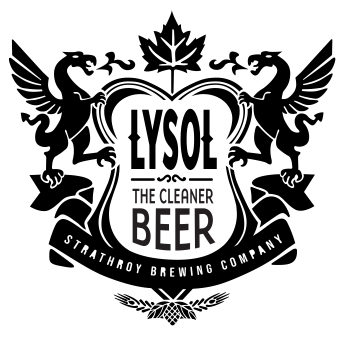

  
  <h2>Strathroy Brewing Company in Partnership with Lysol Canada Present: The Lysol Line-Up<h2>

## Introduction to Project
<h3>What<h3>
Creating a functional, responsive, and dynamic webpage featuring a fictional partnership between the Lysol Company and Ontario's single location micro-brewery - Strathroy Brewing Company.
 
<h3>Why<h3>
For my term 2 final integrated project meant to showcase all I have learned this semester.

## Requirements
Use a modern Browser such as [Firefox](https://www.mozilla.org/en-CA/firefox/new/) or [Chrome](https://www.google.ca/chrome/?brand=CHBD&gclsrc=aw.ds&&gclid=CjwKCAjw29vsBRAuEiwA9s-0B6zIdw5_qV4ETvbcN4042nlkfk9YggWT_DI1vM4UH4vWB2I0pdWUdhoCBWoQAvD_BwE). Avoid internet explorer. You will need git installed locally as well as a good code editor such as [Sublime](https://www.sublimetext.com). Subfolders are included.

### Built With
<ul>

   <li>Html</li>

   <li>CSS</li>

   <li>JS</li>

</ul>

## License
MIT

## Creator:
Emily Morgan
